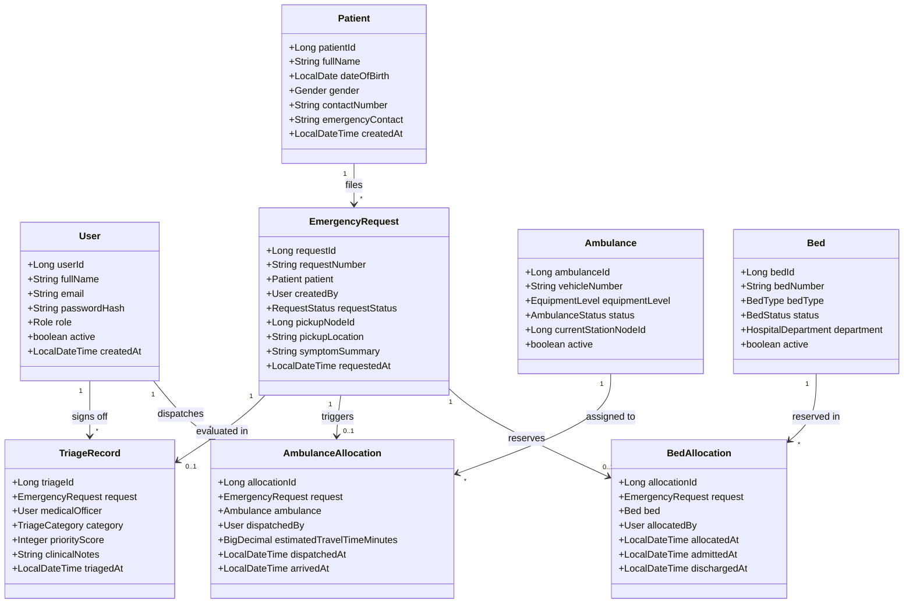
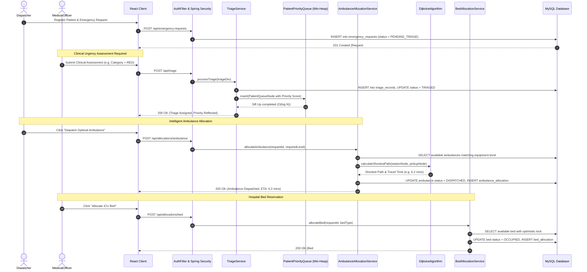
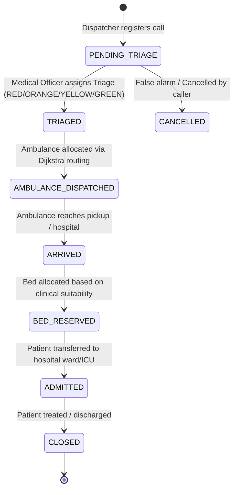

# MediPriority — UML & System Diagrams

## 1. System Class Diagram

```mermaid
classDiagram
    direction TB

    class User {
        +Long userId
        +String fullName
        +String email
        +String passwordHash
        +Role role
        +boolean active
        +LocalDateTime createdAt
    }

    class Patient {
        +Long patientId
        +String fullName
        +LocalDate dateOfBirth
        +Gender gender
        +String contactNumber
        +String emergencyContact
        +LocalDateTime createdAt
    }

    class EmergencyRequest {
        +Long requestId
        +String requestNumber
        +Patient patient
        +User createdBy
        +RequestStatus requestStatus
        +Long pickupNodeId
        +String pickupLocation
        +String symptomSummary
        +LocalDateTime requestedAt
    }

    class TriageRecord {
        +Long triageId
        +EmergencyRequest request
        +User medicalOfficer
        +TriageCategory category
        +Integer priorityScore
        +String clinicalNotes
        +LocalDateTime triagedAt
    }

    class Ambulance {
        +Long ambulanceId
        +String vehicleNumber
        +EquipmentLevel equipmentLevel
        +AmbulanceStatus status
        +Long currentStationNodeId
        +boolean active
    }

    class Bed {
        +Long bedId
        +String bedNumber
        +BedType bedType
        +BedStatus status
        +HospitalDepartment department
        +boolean active
    }

    class AmbulanceAllocation {
        +Long allocationId
        +EmergencyRequest request
        +Ambulance ambulance
        +User dispatchedBy
        +BigDecimal estimatedTravelTimeMinutes
        +LocalDateTime dispatchedAt
        +LocalDateTime arrivedAt
    }

    class BedAllocation {
        +Long allocationId
        +EmergencyRequest request
        +Bed bed
        +User allocatedBy
        +LocalDateTime allocatedAt
        +LocalDateTime admittedAt
        +LocalDateTime dischargedAt
    }

    Patient "1" --> "*" EmergencyRequest : files
    EmergencyRequest "1" --> "0..1" TriageRecord : evaluated in
    EmergencyRequest "1" --> "0..1" AmbulanceAllocation : triggers
    EmergencyRequest "1" --> "0..1" BedAllocation : reserves
    Ambulance "1" --> "*" AmbulanceAllocation : assigned to
    Bed "1" --> "*" BedAllocation : reserved in
    User "1" --> "*" TriageRecord : signs off
    User "1" --> "*" AmbulanceAllocation : dispatches
```

---

## 2. Emergency Workflow Sequence Diagram

```mermaid
sequenceDiagram
    autonumber
    actor Dispatcher
    actor MedicalOfficer
    participant Frontend as React Client
    participant Auth as AuthFilter & Spring Security
    participant TriageSvc as TriageService
    participant Queue as PatientPriorityQueue (Min-Heap)
    participant AmbSvc as AmbulanceAllocationService
    participant Dijkstra as DijkstraAlgorithm
    participant BedSvc as BedAllocationService
    participant DB as MySQL Database

    Dispatcher->>Frontend: Register Patient & Emergency Request
    Frontend->>Auth: POST /api/emergency-requests
    Auth->>DB: INSERT into emergency_requests (status = PENDING_TRIAGE)
    DB-->>Frontend: 201 Created (Request #ER-XXXX)

    Note over MedicalOfficer, Frontend: Clinical Urgency Assessment Required
    MedicalOfficer->>Frontend: Submit Clinical Assessment (e.g. Category = RED)
    Frontend->>Auth: POST /api/triage
    Auth->>TriageSvc: processTriage(triageDto)
    TriageSvc->>DB: INSERT into triage_records, UPDATE status = TRIAGED
    TriageSvc->>Queue: insert(PatientQueueNode with Priority Score)
    Queue-->>TriageSvc: Sift Up completed (O(log N))
    TriageSvc-->>Frontend: 200 OK (Triage Assigned, Priority Reflected)

    Note over Dispatcher, AmbSvc: Intelligent Ambulance Allocation
    Dispatcher->>Frontend: Click "Dispatch Optimal Ambulance"
    Frontend->>Auth: POST /api/allocations/ambulance
    Auth->>AmbSvc: allocateAmbulance(requestId, requiredLevel)
    AmbSvc->>DB: SELECT available ambulances matching equipment level
    AmbSvc->>Dijkstra: calculateShortestPath(stationNode, pickupNode)
    Dijkstra-->>AmbSvc: Shortest Path & Travel Time (e.g. 6.2 mins)
    AmbSvc->>DB: UPDATE ambulance status = DISPATCHED, INSERT ambulance_allocation
    AmbSvc-->>Frontend: 200 OK (Ambulance Dispatched, ETA: 6.2 mins)

    Note over MedicalOfficer, BedSvc: Hospital Bed Reservation
    MedicalOfficer->>Frontend: Click "Allocate ICU Bed"
    Frontend->>Auth: POST /api/allocations/bed
    Auth->>BedSvc: allocateBed(requestId, bedType)
    BedSvc->>DB: SELECT available bed with optimistic lock
    BedSvc->>DB: UPDATE bed status = OCCUPIED, INSERT bed_allocation
    BedSvc-->>Frontend: 200 OK (Bed #ICU-02 Reserved)
```

---

## 3. Emergency Request State Machine Diagram

```mermaid
stateDiagram-v2
    [*] --> PENDING_TRIAGE : Dispatcher registers call

    PENDING_TRIAGE --> TRIAGED : Medical Officer assigns Triage (RED/ORANGE/YELLOW/GREEN)
    PENDING_TRIAGE --> CANCELLED : False alarm / Cancelled by caller

    TRIAGED --> AMBULANCE_DISPATCHED : Ambulance allocated via Dijkstra routing
    AMBULANCE_DISPATCHED --> ARRIVED : Ambulance reaches pickup / hospital
    ARRIVED --> BED_RESERVED : Bed allocated based on clinical suitability
    BED_RESERVED --> ADMITTED : Patient transferred to hospital ward/ICU
    ADMITTED --> CLOSED : Patient treated / discharged
    CLOSED --> [*]
```
